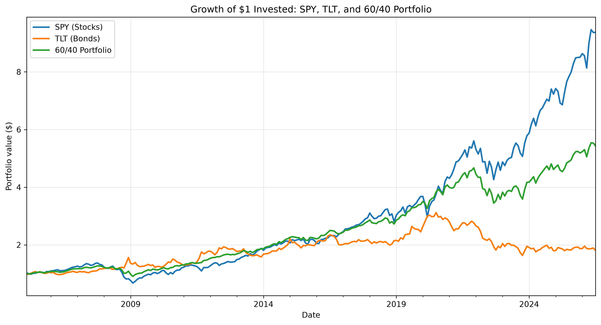
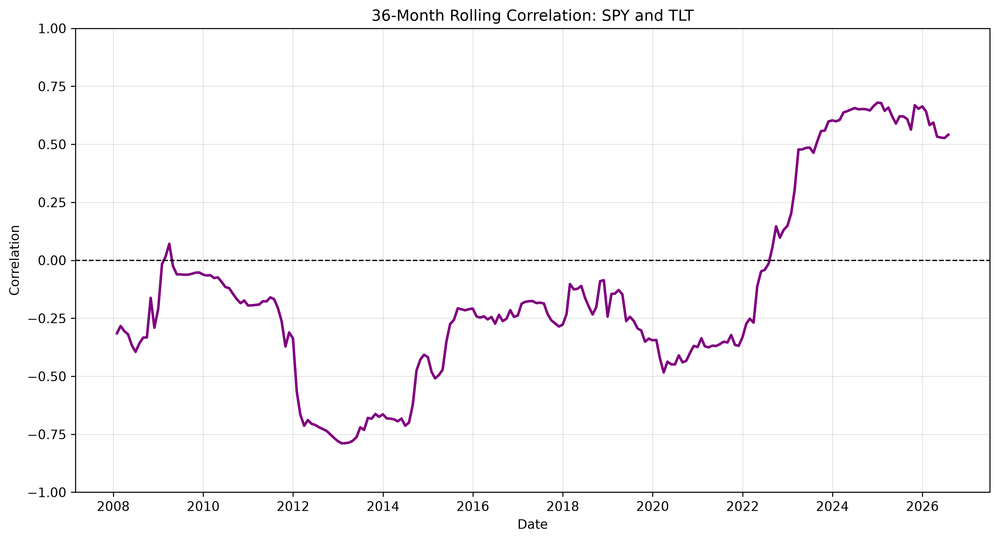
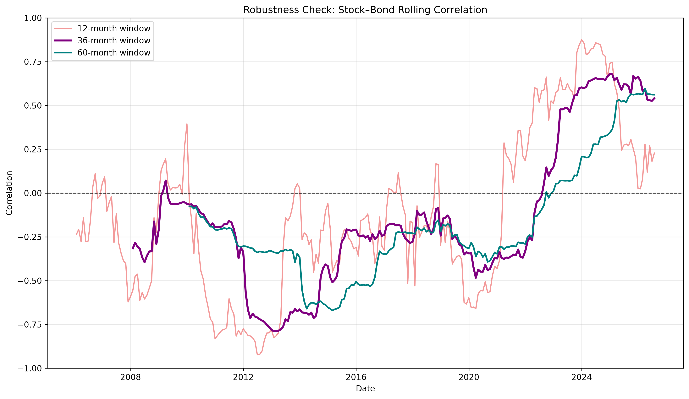
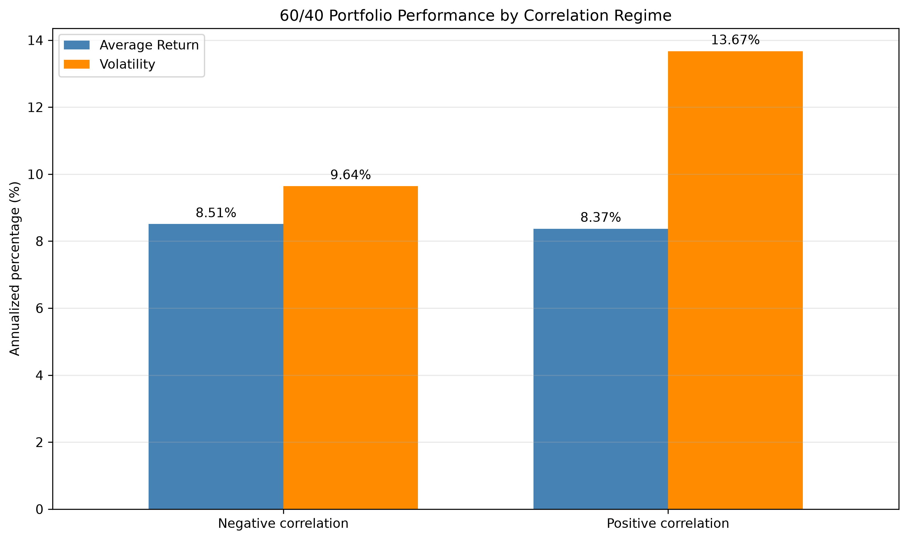
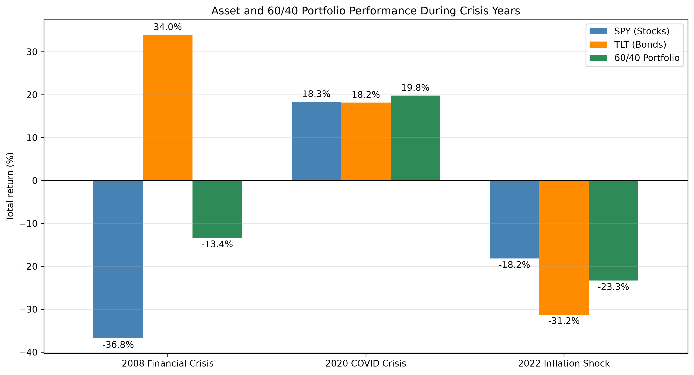
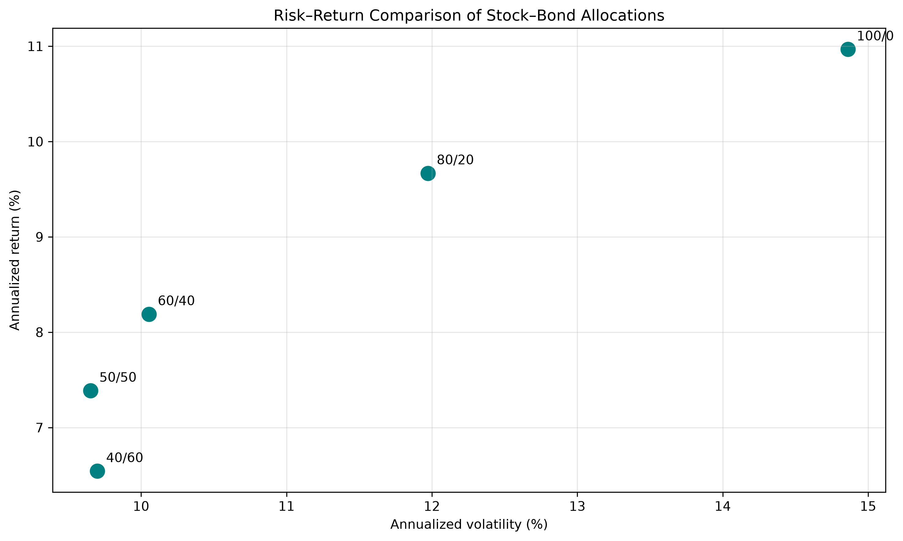

# 60/40 Portfolio Analyzer

A Python project analyzing stock–bond correlation and the historical performance of a traditional 60/40 portfolio.

[Open the interactive dashboard](https://60-40-portfolio-analyzer.streamlit.app)

## Project objective

This project investigates how changes in the relationship between stocks and bonds affect portfolio diversification.

The current analysis uses:

- SPY as a proxy for US stocks
- TLT as a proxy for long-term US Treasury bonds
- Monthly total returns from January 2005 through July 2026
- A portfolio containing 60% SPY and 40% TLT
- Monthly rebalancing

## Current features

- Downloads adjusted historical prices through `yfinance`
- Converts daily prices into monthly total returns
- Constructs a monthly rebalanced 60/40 portfolio
- Calculates annualized return, volatility, maximum drawdown, and Sharpe ratios
- Compares five stock–bond allocations
- Estimates 12-, 36-, and 60-month rolling stock–bond correlations
- Compares portfolio performance across negative- and positive-correlation regimes
- Examines performance during the 2008, 2020, and 2022 crisis years
- Exports result tables to CSV
- Creates and saves six analytical charts
- Organizes data, calculations, analysis, and plotting into separate Python modules
- Provides an interactive Streamlit dashboard with adjustable weights, dates, and correlation windows

## Methodology

Adjusted closing prices for SPY and TLT are converted into month-end total returns. The baseline portfolio allocates 60% to SPY and 40% to TLT and is rebalanced monthly.

Performance is evaluated using annualized return, annualized volatility, maximum drawdown, and the Sharpe ratio. Sharpe ratios use the 13-week US Treasury bill yield (`^IRX`) as the risk-free-rate proxy.

Diversification is examined using a 36-month rolling stock–bond correlation. Portfolio performance is then compared between negative- and positive-correlation regimes. Robustness is assessed using alternative 12- and 60-month windows.

The crisis analysis uses the full calendar years 2008, 2020, and 2022 to ensure that returns are measured over consistent periods. All results are descriptive and based on historical associations.

## Key findings

- The 60/40 portfolio returned 8.19% annually with 10.05% annualized volatility over the sample.
- Portfolio volatility increased from 9.64% during negative-correlation periods to 13.67% during positive-correlation periods, while average returns remained similar.
- The transition toward positive stock–bond correlation around 2022–2023 appears across 12-, 36-, and 60-month windows.
- Bonds substantially cushioned stock losses in 2008, but both assets declined in 2022, causing the 60/40 portfolio to lose 23.31%.
- The 80/20 allocation recorded the highest historical Sharpe ratio among the five tested portfolios, while the 50/50 allocation recorded the lowest volatility.

## Cumulative growth



The chart shows the cumulative value of $1 invested in SPY, TLT, and a monthly rebalanced 60/40 portfolio from January 2005 through July 2026. By the end of the sample, the initial $1 had grown to approximately $9.4 in SPY, $1.9 in TLT, and $5.5 in the 60/40 portfolio. SPY therefore generated the highest cumulative growth, although it also experienced the largest fluctuations, including substantial declines during the 2008 financial crisis, the 2020 COVID crash, and the 2022 market downturn.

TLT followed a different pattern. It provided protection during the 2008 stock-market decline and reached its highest cumulative value around 2020, when falling interest rates supported long-term Treasury prices. TLT subsequently declined substantially as inflation increased and interest rates rose, reducing the present value of its long-dated fixed payments.

The 60/40 portfolio generally remained between the two individual assets. Its bond allocation limited losses relative to SPY in 2008, allowing the portfolio to capture a meaningful portion of long-term equity growth with smaller overall fluctuations. This diversification benefit weakened in 2022, when SPY and TLT declined simultaneously and the portfolio consequently experienced a pronounced loss. After 2022, SPY recovered strongly while TLT remained weak, so the 60/40 portfolio also recovered but grew more slowly than the stock-only investment.

Overall, the chart illustrates the central trade-off of the 60/40 strategy: it sacrificed part of SPY’s long-term return in exchange for greater stability, but the level of protection provided by bonds varied across market environments.

## Rolling stock–bond correlation



The chart reports the 36-month rolling Pearson correlation between monthly total returns on SPY and TLT. Each observation is calculated using the contemporaneous monthly returns from the preceding 36-month window, after which the window advances by one month. Consequently, the plotted series begins later than the underlying January 2005 sample because 36 monthly observations are required to estimate the first correlation coefficient.

The rolling correlation was predominantly negative for most of the sample and reached approximately -0.8 during the early 2010s. Negative correlation indicates that SPY and TLT returns generally moved in opposite directions within the corresponding 36-month windows, allowing the bond allocation to offset part of the variation in equity returns and strengthen the diversification benefit of the 60/40 portfolio.

The relationship changed substantially around 2022–2023. The rolling correlation crossed above zero and subsequently increased to approximately 0.5–0.7. Positive correlation indicates that stocks and bonds increasingly generated returns in the same direction, although it does not indicate whether those returns were positive or negative. This stronger positive co-movement reduced TLT’s effectiveness as a hedge against fluctuations in SPY and increased the portfolio’s exposure to simultaneous losses in both assets.

The results demonstrate that stock–bond correlation is time-varying rather than constant. Therefore, the risk-reduction benefit of combining stocks and bonds depends not only on the individual volatility of each asset but also on how their returns co-move over time.


## Robustness checks



This robustness check evaluates whether the observed evolution of stock–bond correlation is sensitive to the selected rolling-window length. The analysis compares 12-, 36-, and 60-month rolling Pearson correlations calculated from monthly total returns on SPY and TLT. Each coefficient is estimated using the observations contained in the corresponding trailing window, which advances by one month at a time.

The 12-month specification responds most quickly to changes in recent market behaviour because each observation represents a relatively large proportion of the estimation window. It is consequently more volatile and more sensitive to individual months or short-lived market shocks. The 60-month specification incorporates five years of returns, producing a smoother correlation series but reacting more slowly when the underlying relationship changes. The 36-month window provides an intermediate specification that balances responsiveness with estimate stability and is therefore used as the baseline measure in the analysis.

Despite differences in their timing and short-run variation, all three specifications identify the same broad transition. Stock–bond correlation was predominantly negative over much of the historical sample, while the 12-month estimate became positive first and the longer windows subsequently followed around 2022–2023. The delayed response of the 36- and 60-month estimates occurs because their windows continued to include observations from the preceding negative-correlation regime.

Toward the end of the sample, the 12-month correlation declined to approximately 0.2, while the 36- and 60-month measures remained close to 0.5–0.6. This suggests that recent positive stock–bond co-movement has weakened relative to its earlier peak, but the medium- and longer-term relationship remains positive.

The consistency of the broad regime shift across all three window lengths indicates that the main finding is not driven solely by the baseline 36-month specification. However, this comparison should be interpreted as a sensitivity analysis rather than a formal test of a structural break: it demonstrates robustness to alternative window choices but does not establish the statistical significance or permanence of the change in correlation.

## Correlation-regime comparison



Each month is classified according to the sign of the preceding 36-month rolling correlation between SPY and TLT returns. Months with a correlation below zero form the negative-correlation regime, while months with a correlation equal to or above zero form the positive-correlation regime. The comparison contains 173 negative-correlation months and 50 positive-correlation months.

The 60/40 portfolio produced similar annualized mean returns in the two regimes: 8.51% during negative-correlation periods and 8.37% during positive-correlation periods. However, annualized volatility increased from 9.64% to 13.67%, representing an increase of approximately 42%.

This result is consistent with the two-asset portfolio-variance formula:

$$
\sigma_p^2 = w_S^2 \sigma_S^2 + w_B^2 \sigma_B^2 + 2w_Sw_B\sigma_S\sigma_B\rho_{S,B}
$$

The final component is the covariance term. When stock–bond correlation is negative, this term reduces total portfolio variance because movements in one asset tend to offset movements in the other. When correlation is positive, the covariance term increases portfolio variance because stock and bond movements reinforce one another.

The results therefore indicate that positive stock–bond correlation was associated with weaker diversification: investors experienced substantially higher portfolio volatility without receiving a corresponding increase in average return. However, the comparison is descriptive rather than causal. Portfolio volatility also depends on the individual volatilities of SPY and TLT, and the two regimes contain different numbers of observations and correspond to different macroeconomic environments.

## Crisis-period comparison



The chart compares the compounded full-calendar-year returns of SPY, TLT, and the monthly rebalanced 60/40 portfolio during three distinct market disruptions. Monthly portfolio returns are calculated as:

$$
R_{p,m} = 0.60R_{SPY,m} + 0.40R_{TLT,m}
$$

These monthly returns are then compounded across each calendar year. Consequently, the reported 60/40 return is not necessarily equal to a simple weighted average of the two displayed annual asset returns.

During the 2008 financial crisis, SPY lost 36.80% while TLT gained 33.95%. The opposing performance of long-term Treasury bonds offset a substantial part of the equity decline, limiting the 60/40 portfolio’s loss to 13.36%. This illustrates an environment in which bonds provided effective downside diversification.

In 2020, SPY and TLT finished the full calendar year with returns of 18.3% and 18.2%, respectively, while the monthly rebalanced 60/40 portfolio returned 19.8%. These annual figures include both the severe initial COVID-19 market decline and the strong recovery that followed. They therefore describe the final compounded result for the year rather than the magnitude of the temporary crash.

The outcome was substantially different during the 2022 inflation shock. SPY lost 18.18%, TLT lost 31.23%, and the 60/40 portfolio declined by 23.31%. Rising inflation and interest rates placed downward pressure on both equity valuations and long-duration bond prices. With stock–bond correlation positive at approximately 0.51, the two assets tended to move in the same direction, preventing TLT from providing its traditional protection against equity losses.

Together, these episodes demonstrate that the defensive effectiveness of a 60/40 portfolio is regime-dependent. Bonds provided substantial protection in 2008, both assets contributed positively to the full-year outcome in 2020, and both generated losses in 2022. The comparison is descriptive and based on full calendar years; it does not capture within-year volatility, maximum drawdowns, or the precise timing of each crisis and recovery.

## Allocation comparison



The allocation comparison evaluates how changing the relative weights of SPY and TLT affected the historical risk–return trade-off. Five monthly rebalanced portfolios are considered: 100/0, 80/20, 60/40, 50/50, and 40/60, where the first number represents the percentage invested in SPY and the second represents the percentage invested in TLT.

For each allocation, monthly portfolio returns are calculated as:

$$
R_{p,t}=w_SR_{SPY,t}+w_BR_{TLT,t}
$$

where the stock and bond weights sum to one. The vertical axis reports the annualized compound return, while the horizontal axis reports annualized volatility, calculated as the standard deviation of monthly returns multiplied by the square root of 12. Points located higher on the graph generated greater historical returns, while points farther to the left experienced lower volatility.

Increasing the bond allocation generally reduced both return and volatility. The stock-only portfolio achieved the highest annualized return at 10.97%, but also recorded the highest volatility at 14.86%. The 60/40 portfolio achieved an annualized return of 8.19% with volatility of 10.05%, capturing a substantial portion of the equity return while reducing historical fluctuations and maximum drawdown.

The 50/50 portfolio recorded the lowest volatility and smallest maximum drawdown among the tested allocations. Increasing the TLT weight further to 60% did not reduce risk: the 40/60 portfolio produced a lower return and slightly higher volatility than the 50/50 allocation. In this sample, the 40/60 portfolio was therefore historically dominated by 50/50, which provided both a higher return and lower volatility. This result reflects the fact that TLT is not risk-free and remains exposed to substantial long-duration interest-rate risk.

Risk-adjusted performance is evaluated using the Sharpe ratio:

$$
SR_p = \frac{R_p-R_f}{\sigma_p}
$$

where `R_p` represents the portfolio’s average return, `R_f` is the risk-free return, and `σ_p` is portfolio volatility. In the analysis, the Sharpe ratio is estimated from monthly excess returns and annualized using the square root of 12.

Monthly excess returns are calculated using the 13-week US Treasury bill yield (`^IRX`) as the risk-free-rate proxy. The 80/20 allocation recorded the highest historical Sharpe ratio at approximately 0.69, indicating the greatest excess return per unit of volatility among the five tested portfolios. The 60/40 and stock-only portfolios both recorded Sharpe ratios of approximately 0.66, although the 60/40 portfolio experienced substantially lower volatility and a smaller maximum drawdown.

The results do not identify one universally optimal allocation. The stock-only portfolio maximized historical return, 50/50 minimized volatility, and 80/20 produced the highest Sharpe ratio. The preferred portfolio therefore depends on whether an investor prioritizes total return, stability, drawdown protection, or risk-adjusted performance. These findings are specific to SPY and TLT over the January 2005–July 2026 sample and depend on the monthly rebalancing assumption and the use of volatility as the primary measure of risk.

## Limitations

- SPY and TLT represent only US equities and long-duration US Treasury bonds, so the findings may not apply to other markets or bond maturities.
- The analysis uses a sample beginning in January 2005 and therefore does not capture earlier inflation and interest-rate regimes.
- The portfolio assumes fixed monthly rebalancing and excludes transaction costs, taxes, management fees, and bid–ask spreads.
- Crisis periods are measured using full calendar years, which can conceal substantial movements within each year, particularly the 2020 crash and recovery.
- Rolling correlations depend on the selected assets, sample period, data frequency, and window length.
- Historical relationships do not establish causality and do not guarantee future portfolio performance.
- The correlation-regime comparison contains substantially more negative-correlation months than positive-correlation months, so the two regime estimates are based on unequal sample sizes.
- The analysis is descriptive and does not apply formal statistical tests for differences between regimes or structural breaks in the stock–bond relationship.


## Interactive dashboard

The Streamlit dashboard allows users to explore how portfolio construction and stock–bond correlation affect historical performance. Users can adjust the stock and bond weights, select the sample period, and change the rolling-correlation window. The dashboard automatically downloads market data and recalculates:

- Annualized return
- Annualized volatility
- Maximum drawdown
- Cumulative growth of $1
- Rolling stock–bond correlation

All metrics and charts update automatically when the selected inputs change, allowing users to compare different portfolio allocations and examine how diversification evolved over time.


**[Open the live interactive dashboard](https://60-40-portfolio-analyzer.streamlit.app)**

After installing the required packages, launch the dashboard with:

```bash
python3 -m streamlit run dashboard.py
```

The dashboard opens locally in a web browser. Keep the terminal process running while using it.


## Installation and usage

Clone the repository and open the project folder:

```bash
git clone https://github.com/veronikaplchova/60-40-portfolio-analyzer.git
cd 60-40-portfolio-analyzer
```

Install the required Python packages:

```bash
python3 -m pip install -r requirements.txt
```

Run the complete analysis:

```bash
python3 portfolio_analysis.py
```

The script downloads updated market data, prints performance tables in the terminal, and saves CSV results and charts in the `results` folder.

An internet connection is required because the market data are downloaded through Yahoo Finance.


## Project structure

The project is divided into focused Python modules:

- `config.py` defines tickers, portfolio weights, dates, and the main correlation window.
- `data.py` downloads market data and prepares monthly returns and risk-free rates.
- `metrics.py` calculates annualized performance, volatility, maximum drawdown, and Sharpe ratios.
- `analysis.py` constructs portfolios and performs correlation-regime, crisis-period, and robustness analyses.
- `plots.py` creates and saves the static analysis visualizations.
- `portfolio_analysis.py` coordinates the full analytical workflow.
- `dashboard.py` provides the interactive Streamlit user interface.

## Data source

Historical market data are downloaded through the `yfinance` Python package.

## Status

The core analysis and interactive dashboard are complete. Potential future extensions include additional asset classes, alternative equity and bond proxies, formal structural-break tests, and dynamic-correlation models such as DCC-GARCH.